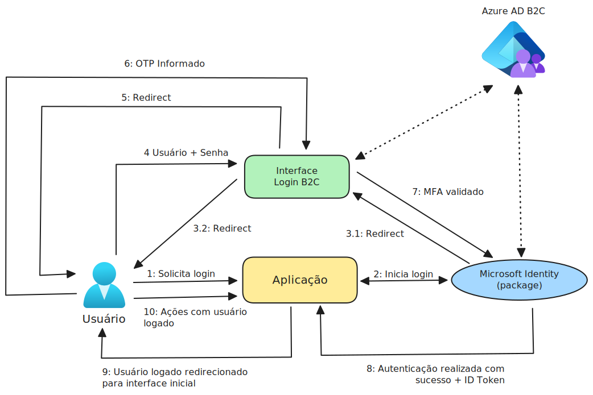
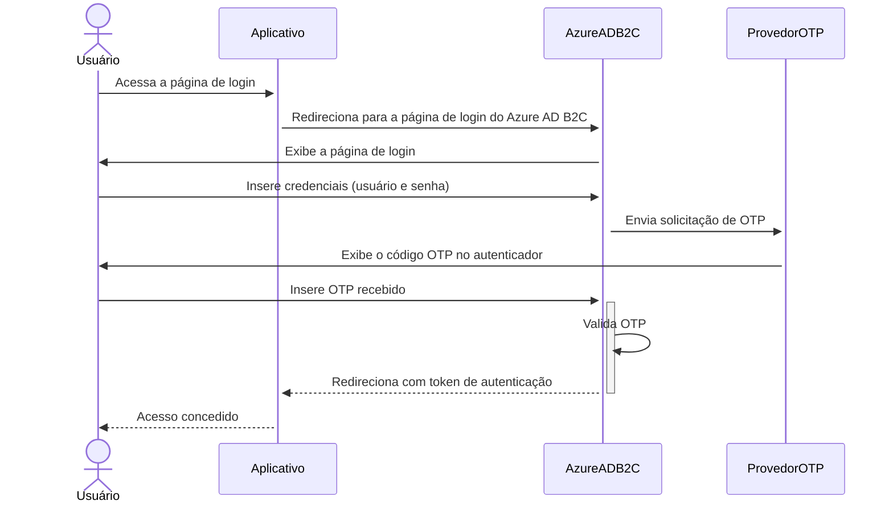

# DiagramasArquitetura-2024-07
Exemplos e recomendações para a elaboração de diagramas de arquitetura utilizando Excalidraw, Mermaid e Draw.io. Conteúdo apresentado no dia 25/07/2024.

## Rascunho do fluxo em Excalidraw

## Representação do fluxo em Mermaid

## Componentes utilizados (draw.io)

